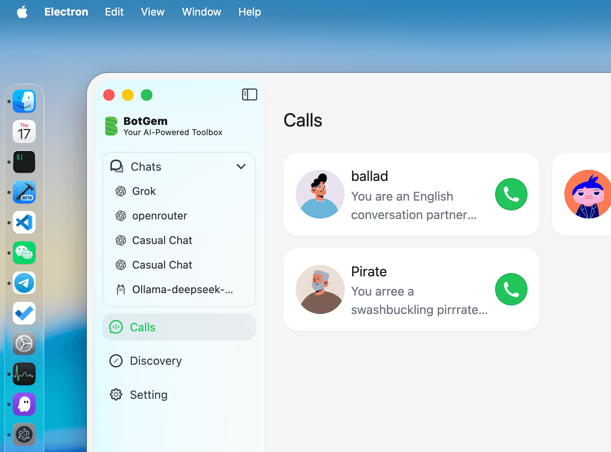

# super-browser-window-kit Example



<video src="./docs/liquid-glass.mp4" autoPlay loop muted></video>

🪄 Modern macOS window visual effects for Electron applications

Native Liquid Glass effect View, native rounded window corners

## ✨ Features

- 🪟 **Native Rounded Corners** - Perfectly aligned with macOS 26's refined window aesthetics and design language
- 🌟 **Liquid Glass Effect** - Stunning dynamic material that refracts content, reflects light, and creates gorgeous lensing effects along edges
- 📦 **TypeScript Support** - Full type definitions optimized for modern Electron development workflows

## 🛠 Installation

```bash
npm install super-browser-window-kit
git clone https://github.com/gaodeng/super-browser-window-kit-example.git
cd super-browser-window-kit-example
npm install
npm run dev
```

## 🎯 Quick Start

```js
const { app, BrowserWindow } = require("electron");
const {
  default: SuperBrowserWindowKit,
  AutoresizingMask,
  GlassMaterialVariant,
  SystemColor,
} = require("super-browser-window-kit");

/**
 * =====================[ LICENSE NOTICE ]=====================
 * This license code is valid only for com.github.Electron test builds.
 * It will NOT work in production environments.
 * For production use, please obtain a valid commercial license.
 *
 * Official website: https://bytemyth.com/super-browser-window-kit
 * Contact: hi@bytemyth.com
 * ===========================================================
 */
const LICENSE_CODE = "GCAYQ-ASCAG-Q76KA-ELXLU-HN8CV-3ZK8P-STALL-QLSVZ-9FFSX-3S2ZU-4QVSC-LLJ7U-KH6K7-G88HA-4TTDJ-58G9H-GZFY6-DDSDJ-L5ZB9-V7UMB-896CS-P9AVC-GULAB-EEAGQ-T77DP-DRBJN-G829M-ZZF9M-L2VEN-RZM8F-SQ4KW-3JLLB-MUVXP-TS3P8-7ZFZM-4L2P3-S4TTA-Z7EVY-Z5H9J-FYDUS-WQCYW-C92PZ-BB23J-QZEVP-QNQ";

app.whenReady().then(() => {
  const win = new BrowserWindow({
    width: 1000,
    height: 700,
    titleBarStyle: "hiddenInset",
    trafficLightPosition: { x: 20, y: 20 },
    show: false,
  });
  
  win.loadFile("index.html");
  
  SuperBrowserWindowKit.setLicense(LICENSE_CODE);
  SuperBrowserWindowKit.enableWindowCornerCustomization();
  SuperBrowserWindowKit.setWindowCornerRadius(win.getNativeWindowHandle(), 26);
  
  win.show();
});
```

## 📄 License

Test license for `com.github.Electron` builds only. For production, get a commercial license from [ByteMyth](https://bytemyth.com/super-browser-window-kit).

## 🔗 Links

- [Official Website](https://bytemyth.com/super-browser-window-kit)
- [NPM Package](https://www.npmjs.com/package/super-browser-window-kit)
- [Electron Fiddle Example](https://gist.github.com/gaodeng/4ca07e70b32701b99fbe0063efb9cdb9)